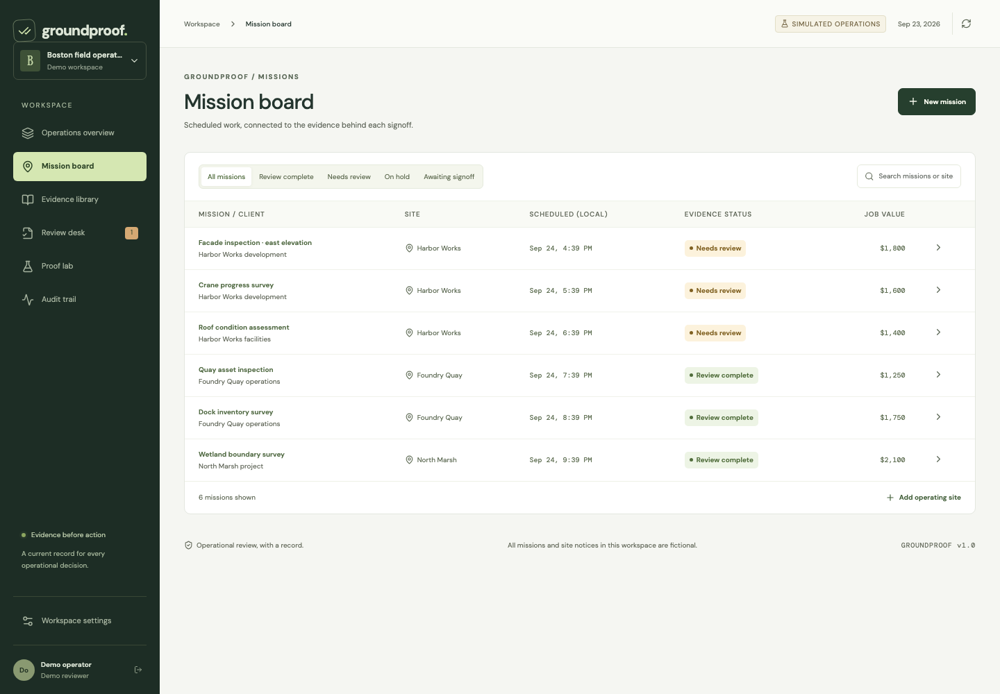
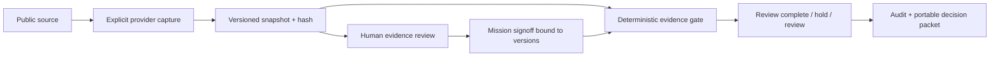

# GroundProof

**Yesterday's approval. Today's evidence.**

[Open the live product](https://groundproof.groundproof.workers.dev) · [Submission](docs/SUBMISSION.md) · [Pitch deck](docs/deliverables/groundproof-pitch.pptx) · [Pilot brief](docs/deliverables/groundproof-pilot-brief.pdf)

GroundProof is an operational evidence desk for commercial drone inspection teams. It binds a mission's human signoff to the exact source versions reviewed. When evidence changes, expires, fails capture, or is held by a reviewer, affected work loses its old signoff. An unchanged source or a successful recovery does not silently revive a revoked approval.

Built for the **HTCJ × PROOF Aviation Futures Challenge 2026**, led by **Shivam Gupta**, with AI-assisted research, engineering, design, and verification.

> Operational review is the scope. GroundProof does not issue flight permissions, provide live airspace clearance, interpret law, control aircraft, or replace the remote pilot's obligations. All seeded missions and site notices are fictional.



## Start in two minutes

Requires Node.js 22 and npm. No paid services or API keys are required.

```sh
npm ci
npm run build
npm start
```

Open **http://localhost:3001** and choose **Explore the working demo**. Each visitor receives an isolated, persistent demo workspace. Or choose **Create workspace** to start an empty private account. Use a password of at least 12 characters. This release has one owner per workspace; it does not pretend to support team invitations or password recovery.

For development, `npm run dev` starts the API on port 3001 and Vite on 5173. Data lives in `data/groundproof.sqlite`, which is excluded from Git. Self-hosted fonts keep the UI usable without third-party font requests.

## The defining demonstration

1. Open the isolated Boston field-operations demo: six fictional missions, three sites, five evidence sources.
2. Choose **Simulate site closure**. A fictional access notice changes.
3. Exactly three dependent missions lose their signoffs; their combined booked scenario value is **$4,800**. This is not claimed revenue or measured savings.
4. Open **Review desk** to inspect the old and new snapshots. Record a hold with an explanation.
5. In **Proof lab**, choose **Updated access notice**. Recovery alone does not release the work.
6. Review the new source, accept it with a note, then open a mission and sign off its current evidence.
7. Export the decision packet and verify its integrity independently. Run the authored verification suite in the Proof lab.

Live-source demonstration: add an official FAA or Boston page in **Evidence library**, choose Direct or Anakin, capture it, and inspect its real provider, timestamp, content, and hash. Anakin errors remain Anakin errors; there is no hidden provider substitution.

## Implemented workflow

- Password authentication using salted scrypt, opaque hashed server sessions, HttpOnly/SameSite cookies, Secure cookies under HTTPS, rate limits, and tenant checks.
- Site register, linked mission creation/editing, and source registration.
- Operator-supplied evidence excerpts with a reference, version history, and declared expiry checked through the scheduled job.
- Explicit live capture from supported government HTTPS domains, optional Anakin capture, and opt-in scheduled monitoring.
- Content hashing, immutable snapshot history, conservative source freshness, source review, separate mission signoff, and transactional version checks.
- Isolated failure drills for changed, stale, and unavailable evidence.
- Audit history and self-contained decision-packet exports with an independent verifier.
- Printable human-readable decision reports alongside the machine-verifiable JSON packet.
- Responsive UI, accessible forms, keyboard navigation, evidence comparison, and an assumptions-based ROI calculator.
- Node/SQLite single-instance deployment and a Cloudflare Durable Objects deployment adapter.

## Verify the implementation

```sh
npm run build
npm test
npm run test:workers
npm run typecheck:workers
npx playwright install chromium
npm run test:e2e
npm audit
```

The browser suite runs real workflows at desktop and mobile sizes and includes accessibility checks. It requires the app to be running; see `playwright.config.ts` for the base URL. Live public-source tests depend on upstream availability. Unit and API tests use deterministic fixtures and isolated databases.

To verify an exported packet:

```sh
npx tsx scripts/verify-packet.ts path/to/packet.json
```

A matching embedded checksum detects accidental changes; anyone who edits a packet could also recompute its checksum. Use `--expected-hash` with a separately trusted digest for tamper detection against that trust anchor. This is not a digital signature or legal attestation.

## Architecture



The same evidence rules power the workspace, tests, and interactive Proof lab. No LLM is responsible for readiness decisions. Captured text is treated as untrusted data and rendered as text. Content changes conservatively require human review; the software does not decide whether a page edit changes the law.

| Area | Implementation |
|---|---|
| Client | React, TypeScript, Vite, Lucide icons, locally hosted OFL fonts |
| API | Fastify, Zod, same-origin session authentication |
| Persistence | SQLite/WAL locally; SQLite-backed Durable Object in the cloud |
| Evidence | SHA-256, version-bound reviews, exact dependency coverage, freshness checks |
| Integration | Anakin web API; Direct government HTTPS capture |
| Tests | Vitest, Fastify injection, Playwright, axe accessibility |

## Deployment and limits

See [Deployment](docs/DEPLOYMENT.md), [Cloudflare deployment](docs/CLOUDFLARE.md), [API](docs/API.md), [Anakin integration](docs/ANAKIN.md), and [Security](docs/SECURITY.md). `PUBLIC_ORIGIN` must be the exact HTTPS origin in production. Secrets are server-only; never use a `VITE_` prefix for API keys. The Docker setup mounts persistent SQLite storage and runs without root.

A working, tested release is not proof of field reliability or enterprise readiness. Before a real pilot: review source coverage with an operator, verify backups and restore, agree on retention and access, and run the workflow in shadow mode. There is no field trial, certified safety claim, paying customer, or measured operational saving in this submission.

## Submission package

- [Release verification](docs/RELEASE-VERIFICATION.md)
- [Submission text](docs/SUBMISSION.md)
- [Verbatim video script and shot list](docs/DEMO-SCRIPT.md)
- [Commercial case and competitors](docs/BUSINESS.md)
- [Four-week shadow pilot](docs/PILOT.md)
- [Primary-source research](docs/SOURCES.md)
- [Rubric review](docs/RUBRIC.md)
- [Artifact editing and generation](docs/ARTIFACTS.md)
- [Organizer questions and conflicting dates](docs/ORGANIZER-QUESTIONS.md)

The published rules currently conflict with the headline/event schedule. The checklist targets readiness before the earliest published date, October 8, pending clarification. It does not silently assume the latest date is safe.

## Attribution and license

Shivam Gupta: founder, product direction, project ownership and presentation. Built with AI-assisted development. Significant dependencies and research are disclosed in this repository; third-party tools and reference material are not presented as original inventions. Code is MIT licensed. Font licenses are retained in `public/fonts`. Government content captured by users retains its source attribution and is not bundled as proprietary GroundProof content.
