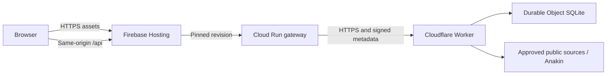

# Firebase deployment

The public site is **https://groundproof-flight.web.app**. Firebase Hosting serves the compiled React application. A small Cloud Run gateway forwards same-origin API requests to the existing Cloudflare application, where Durable Object SQLite continues to store accounts, evidence, approvals, and audit events. The gateway stores no application data on its filesystem.



The original [Cloudflare URL](https://groundproof.groundproof.workers.dev) remains available. Both sites use the same database. Browser sessions are scoped to each hostname, so a user signs in separately after switching sites.

## Deployed resources

| Resource                  | Value                                                                    |
| ------------------------- | ------------------------------------------------------------------------ |
| GCP/Firebase project      | `gen-lang-client-0444960702`                                             |
| Hosting site              | `groundproof-flight`                                                     |
| Alternate Firebase domain | `groundproof-flight.firebaseapp.com`                                     |
| Cloud Run service         | `groundproof-api`                                                        |
| Cloud Run region          | `us-central1`                                                            |
| Runtime service account   | `groundproof-gateway@gen-lang-client-0444960702.iam.gserviceaccount.com` |
| Gateway secret            | Secret Manager `groundproof-gateway-key`, version `1`                    |
| Matching Worker binding   | `FIREBASE_GATEWAY_SECRET`                                                |

These resources are isolated additions in an existing billed project. Existing applications were not replaced. The separate, initially created `groundproof-aviation` project is unbilled and is not used by this deployment; the account could not link another project because its billing-project quota was reached.

## Sessions, origins, and request isolation

Firebase forwards only its special `__session` cookie to a dynamic backend. The gateway translates that cookie to GroundProof's existing session-cookie name on upstream requests and reverses the translation on responses. Tokens stay opaque, and cookies retain `Secure`, `HttpOnly`, `SameSite=Strict`, and their expiry. Duplicate or malformed session cookies are rejected. All API responses explicitly set `Cache-Control: private, no-store, max-age=0`. See [Firebase cache and cookie behavior](https://firebase.google.com/docs/hosting/manage-cache).

The browser still calls `/api` on the Firebase origin. Before forwarding a mutation, the gateway checks an exact origin allowlist and rejects cross-site fetches. Only after that check does it translate the Origin header to the upstream Worker's canonical origin. It follows no upstream redirects, accepts at most 256 KiB of input, and uses a 55-second upstream timeout. No credential or gateway secret enters the frontend build.

The gateway signs its rate-limit metadata with HMAC-SHA256. The Worker verifies the timestamp, method, path, network value, and signature, then overwrites internal headers before forwarding to the application. This signature does not authenticate a user. Normal database-backed sessions and tenant checks still apply. Authenticated Firebase requests use the verified account ID for request limits. Anonymous requests use a conservative Google-added network hop; multiple anonymous visitors can share that limit. Arbitrary caller-supplied forwarded IP addresses are never trusted as identity.

The gateway runtime account can access only its dedicated secret. Public invocation is enabled only on this Cloud Run service, as required by the Hosting rewrite; the application retains its normal session authorization. Direct gateway requests receive the same origin, size, cache, and session checks.

## Update the deployment

Prerequisites: Node 22 or newer, `npm ci`, authenticated `gcloud`, authenticated Wrangler, and Firebase CLI access to the project. The script invokes a pinned Firebase CLI through `npm exec`; it is not an application dependency.

For a release that changes the backend or Worker, publish the tested durable backend first:

```sh
npm run typecheck:workers
npm run test:workers
npm run deploy
```

Then build and publish the Firebase application and gateway:

```sh
bash scripts/deploy-firebase.sh
```

The script builds the frontend, runs the gateway tests, deploys only `deploy/firebase/proxy` to Cloud Run, publishes only this Hosting site's `dist` files, and runs an authenticated smoke test against the Firebase URL. It does not create billing links, provision infrastructure, or change other Hosting sites. The smoke test creates a synthetic account and test evidence, then verifies logout and recovery behavior without printing credentials.

Optional script overrides are `FIREBASE_PROJECT`, `FIREBASE_REGION`, `FIREBASE_GATEWAY_SERVICE`, `FIREBASE_GATEWAY_ACCOUNT`, and `FIREBASE_GATEWAY_SECRET_VERSION`. If moving to another project, site, service, or region, also update `.firebaserc`, `firebase.json`, and the script's public origins and final smoke URL. Defaults intentionally target the deployed application.

`firebase.json` routes `/api` and `/api/**` before the SPA fallback. Its `pinTag: true` pins the Cloud Run revision to the Hosting release. Firebase dynamic requests have a 60-second limit; longer capture work must fail visibly or move to a job workflow. See [Hosting with Cloud Run](https://firebase.google.com/docs/hosting/cloud-run) and [rewrite configuration](https://firebase.google.com/docs/hosting/full-config).

## Secret rotation

Generate a new random secret of at least 32 characters into a protected temporary file. Add it as a new version of the existing Secret Manager secret, update the Worker's `FIREBASE_GATEWAY_SECRET` through `wrangler secret put` from standard input, and redeploy the gateway using the new version number. Never put the value in source, a command argument, build variables, or a frontend environment file. Rotation briefly makes signed metadata unverifiable between updates; normal user-session checks remain enforced, while rate limits fall back to the direct upstream network.

The optional `ANAKIN_API_KEY` remains only in the Worker. The Firebase gateway does not need or receive that provider key.

## Cost and capacity

Cloud Run uses one CPU, 128 MiB memory, first-generation execution, request-based billing, zero minimum instances, one maximum instance, concurrency 40, and a 60-second request timeout. These settings limit idle cost and bound pilot capacity. A single instance can still accumulate billable usage; this is not a spending cap or an availability guarantee.

The deployment uses the user's existing billing account. Cloud Run's request-based free allowance is shared across that billing account, and Hosting, network transfer, builds, image storage, and secrets have their own usage rules. Existing project traffic may already consume allowances. A zero bill is not guaranteed. See [Cloud Run pricing](https://cloud.google.com/run/pricing) and [Firebase pricing](https://firebase.google.com/pricing). Review usage and budget alerts before expanding the pilot.

## Verification and rollback

```sh
node --test deploy/firebase/proxy/server.test.mjs
node scripts/smoke-worker.mjs https://groundproof-flight.web.app --registration
```

The smoke test exercises the actual same-origin deployment, including secure cookies, tenant separation, evidence review and mutation, packet validation, history, password rotation, one-use recovery, and logout. Browser verification is separate from this HTTP test and should also run against the Firebase URL before calling a release complete.

Use the Hosting console's release history to roll back this site's static assets and pinned gateway revision together. The durable backend has an independent release history in Cloudflare; roll it back only to a version compatible with the current schema. Neither frontend rollback resets evidence data. See [Firebase release rollback](https://firebase.google.com/docs/hosting/deploying).

Operational limits remain those in [CLOUDFLARE.md](CLOUDFLARE.md) and [SECURITY.md](SECURITY.md): one pilot database, operator-managed backups, no multi-region disaster-recovery claim, and no flight authorization or regulatory certification.
